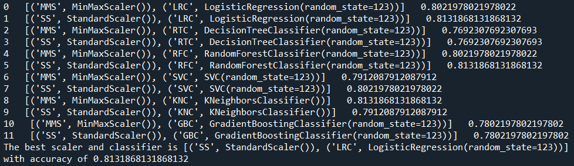
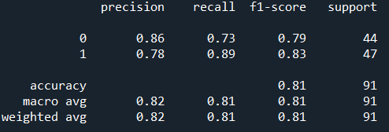
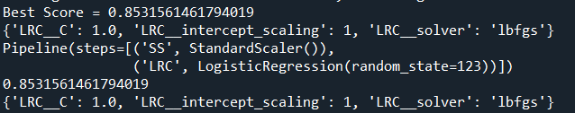
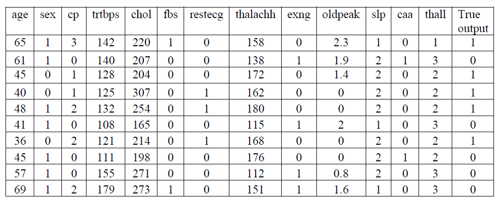
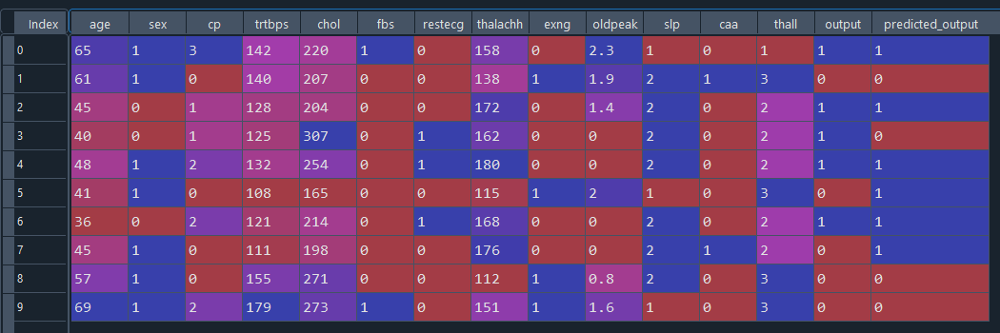
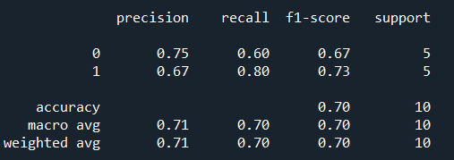
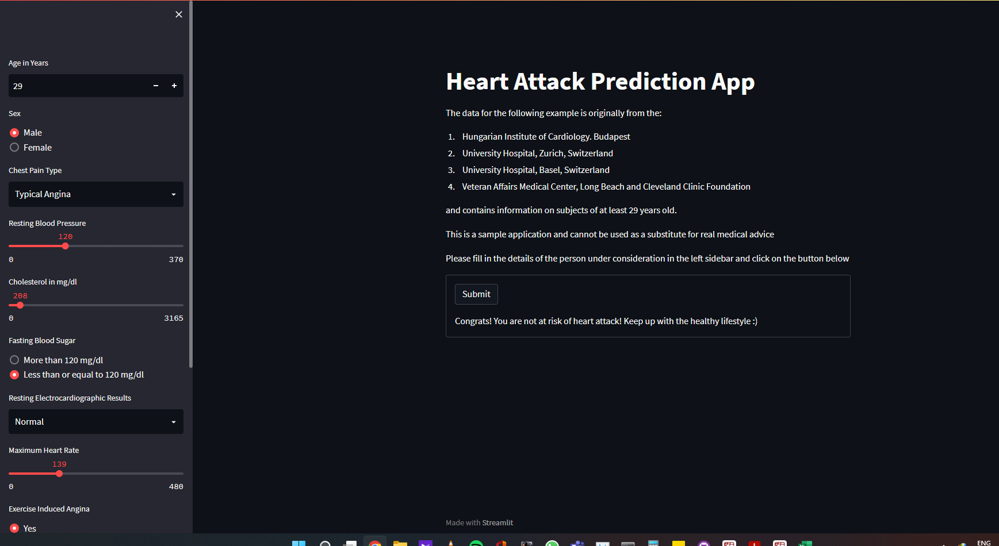
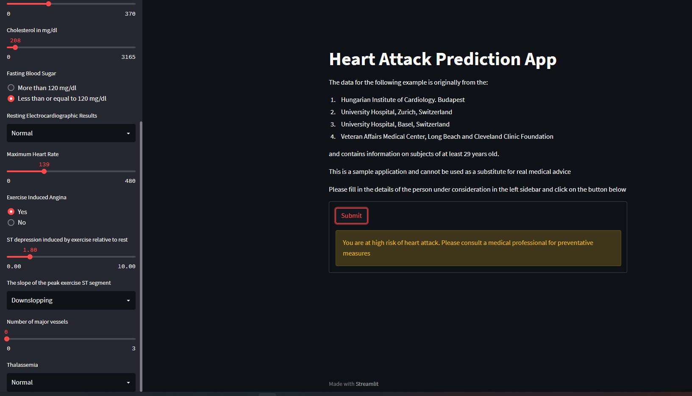

# Prediction of the Likelihood of Getting a Heart Attack

This Machine Learning project is an assignment project to predict the likelihood of getting a heart attack.

For a live demo, please click [here](https://alfredm91-heart-attack-prediction-heart-attack-app-wb6m3d.streamlitapp.com/) to go to the Streamlit app.

## Table of Contents
* [General Info](#general-information)
* [Technologies](#technologies)
* [Installation](#installation)
* [Model Development](#model-development)
* [Model Deployment](#model-deployment)
* [Room for Improvement](#room-for-improvement)
* [Credits and Acknowledgments](#credits-and-acknowledgements)
* [Contact](#contact)

## General Information

This Machine Learning project is able to predict the likelihood of getting a heart attack based on your health profile. It will help medical practicioners to identify said patient and advise him/her on preventative measures to avoid getting a heart attack in the future.

According to World Health Organisation (WHO), every year around 17.9 million deaths are due to cardiovascular diseases (CVDs) predisposing CVD becoming the leading cause of death globally. CVDs are a group of disorders of the heart and blood vessels, if left untreated it may cause heart attack. Heart attack occurs due to the presence of obstruction of blood flow into the heart. The presence of blockage may be due to the accumulation of fat, cholesterol, and other substances. Despite treatment has improved over the years and most CVD’s pathophysiology have been elucidated, heart attack can still be fatal.

Thus, clinicians believe that prevention of heart attack is always better than curing it. After many years of research, scientists and clinicians discovered that, the probability of one’s getting heart attack can be determined by analysing the patient’s age, gender, exercise induced angina, number of major vessels, chest pain indication, resting blood pressure, cholesterol level, fasting blood sugar, resting electrocardiographic results, and maximum heart rate achieved.

## Technologies

- Python 
    - Spyder (Python 3.8.13) 
    - Google Colab (Python 3.6) 
        - Scipy 1.7.3 
        - Pandas 1.4.3 
        - Numpy 1.22.3 
        - Seaborn 0.11.2 
        - Matplotlib 3.5.1 
        - Scikit Learn 1.0.2 
        - Streamlit 1.11.0 
<!--         - Tensorflow 2.3.0  -->
 
## Installation

1) Go to [Google Colab](https://colab.research.google.com/) and sign in with your Google account
2) Download the models folder from the repository and upload it in Google Colab
3) Run the model

## Model Development

- This dataset is a classification problem, thus Supervised Machine Learning algorithm was used.
- In order to select the best Machine Learning model for development and deployment, Scikit Learn Pipeline was used to evaluate between the models below:

1) Logistic Regression Classifier
2) Decision Tree Classifier
3) Random Forest Classifier
4) Support Vector Classifier
5) K Neighbors Classifier
6) Gradient Boost Classifier

From the algorithm above, Logistic Regression model with Standard Scalar scaling was found to produce the highest accuracy at 81.3%.

Below is the classification report produced by running Logistic Regression model with Standard Scalar scaling:

To further optimize this model, Scikit Learn Grid Search CV was used to tune the hyperparameters of the algorithm. Below is the hyperparameters that were found to produce an even better accuracy:

From the hyperparameters tuning performed with Scikit Learn Grid Search method, the model's accuracy was further improved to 85.3%.

## Model Deployment

In order to test the model deployed, the following test case dataset was used:

By running the dataset in the Machine Learning model, it returned the following output:

The model predicted the outcome with a 70% accuracy as shown in the classification report below:

## Streamlit App Deployment

To futher make the model readily utilized by more users, it was deployed on a Streamlit app. You may try the live demo of the app by clicking the image below:

 

Below is an example of the outcome if the model predicts the likelihood of heart attack is low:

If the model predicts that you are at high risk of getting a heart attack, this will be shown instead:

## Project Status

Project is completed.

## Room for Improvement

Room for improvement:
- Streamlit app design

To do:
- Come up with a more user friendly and catching design for the Streamlit app

## Credits and Acknowledgements

This data was sourced from [Heart Attack Analysis Prediction Dataset | Kaggle](https://www.kaggle.com/rashikrahmanpritom/heart-attack-analysis-prediction-dataset)

Creators of the original dataset:
1. Hungarian Institute of Cardiology. Budapest: Andras Janosi, M.D.
2. University Hospital, Zurich, Switzerland: William Steinbrunn, M.D.
3. University Hospital, Basel, Switzerland: Matthias Pfisterer, M.D.
4. V.A. Medical Center, Long Beach and Cleveland Clinic Foundation:Robert Detrano, M.D., Ph.D.

Donor:
David W. Aha (aha '@' ics.uci.edu) (714) 856-8779

Special thanks to Alex Koh and Warren Loo from SHRDC and Dr Mohammed Al-Obaydee from HRD Academy for the guidance and training to make 
this project possible.

## Contact

Created by [@Muhammad Al Mubarak Zainal Abeeden](https://www.linkedin.com/in/m-almubarak-za/) - Any suggestions or feedbacks are welcomed. Feel free to contact me!
